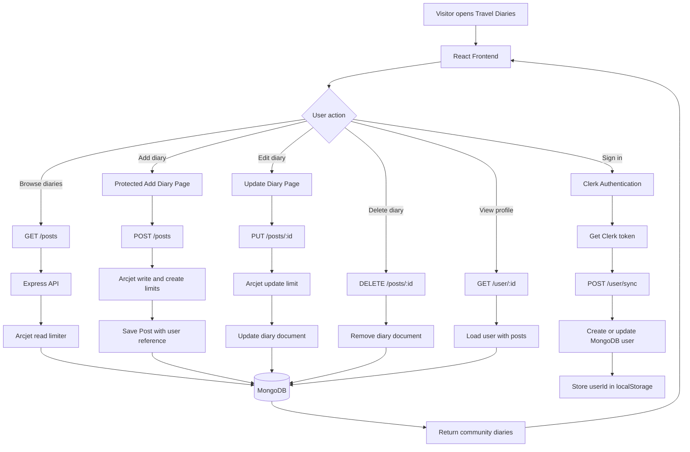
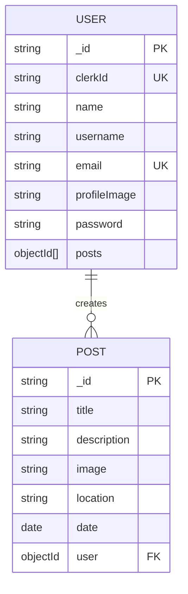
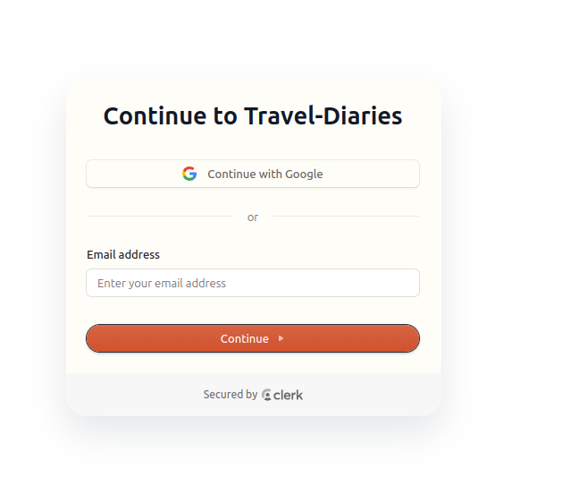
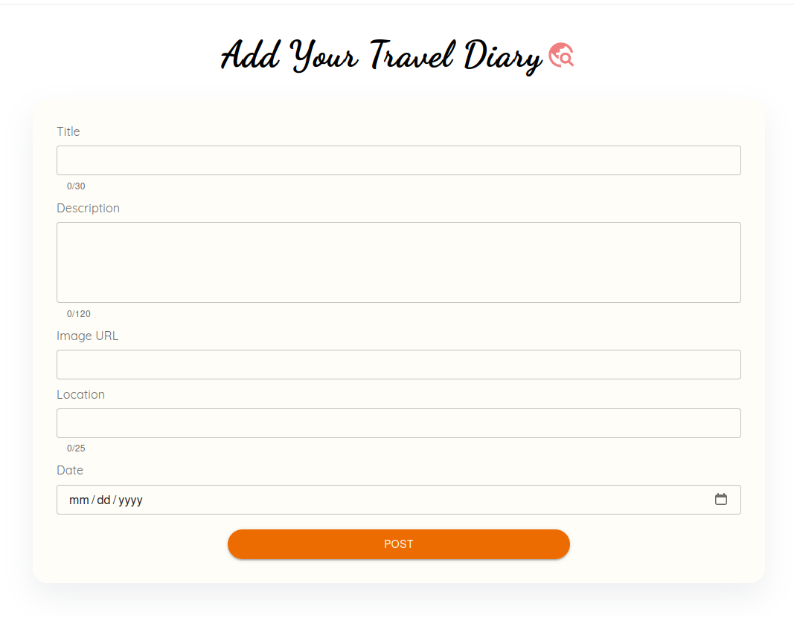
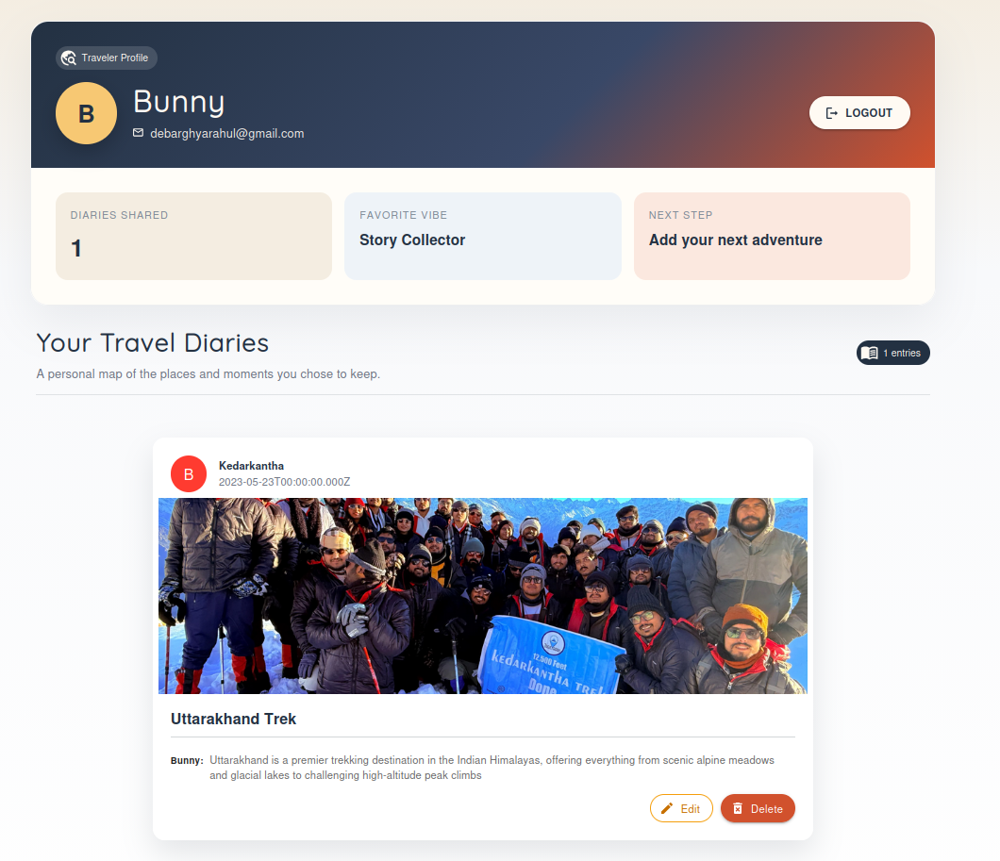

# 🌍 Travel Diaries

Travel Diaries is a MERN stack web application where users can create, browse, update, and manage travel memories with images, locations, dates, and short diary descriptions.

## 🌐 Live Demo

https://traveldiaries.debarghya.org   👈

## 💡 Motivation

Travel memories are often scattered across photos, notes, and social media posts. Travel Diaries brings those memories into one organized platform where users can document journeys, share experiences, and revisit their favorite places through a simple diary-style interface.

## ✨ Features

- 🏠 Travel-themed landing page
- 🌐 Community diary feed
- 🔐 Clerk-based authentication
- 👤 User profile with personal diaries
- ➕ Add new travel diary entries
- ✏️ Update existing diary entries
- 🗑️ Delete diary entries
- 🚦 Arcjet rate limiting for API protection
- 📱 Responsive React UI with Material UI
- 🗄️ MongoDB-backed persistent storage

## 🏗️ Architecture

### 1. 3-Tier Client-Server Architecture

```text
┌─────────────────────────────────────────────────────────────────────┐
│ Tier 1: Client / Presentation Layer                                 │
│                                                                     │
│ React Frontend                                                      │
│ ├─ Landing Page                                                     │
│ ├─ Community Diaries                                                │
│ ├─ Login / Auth Page                                                │
│ ├─ Add Diary Page                                                   │
│ ├─ Update Diary Page                                                │
│ └─ User Profile Page                                                │
└───────────────────────────────┬─────────────────────────────────────┘
                                │
                                ▼
┌─────────────────────────────────────────────────────────────────────┐
│ Tier 2: Application / Business Logic Layer                          │
│                                                                     │
│ Express Backend                                                     │
│ ├─ REST API routes for users and posts                              │
│ ├─ Clerk middleware for authenticated user sync                     │
│ ├─ Controllers for diary CRUD operations                            │
│ ├─ Arcjet rate limiting for API protection                          │
│ ├─ CORS configuration                                               │
│ └─ Request validation and response handling                         │
└───────────────────────────────┬─────────────────────────────────────┘
                                │
                                ▼
┌─────────────────────────────────────────────────────────────────────┐
│ Tier 3: Data / External Services Layer                              │
│                                                                     │
│ MongoDB + External Services                                         │
│ ├─ MongoDB database                                                 │
│ ├─ Mongoose models for User and Post                                │
│ ├─ Clerk authentication                                             │
│ └─ Arcjet security and rate limiting                                │
└─────────────────────────────────────────────────────────────────────┘
```

### 2. System Architecture & Workflow Diagram



## 📁 Folder Structure

```text
travel-diaries/
├── backend/
│   ├── package.json
│   ├── starting-app/
│   └── travelDiaries/
│       ├── app.js
│       ├── controllers/
│       │   ├── post-controller.js
│       │   └── user-controllers.js
│       ├── lib/
│       │   └── arcjet.js
│       ├── models/
│       │   ├── Post.js
│       │   └── User.js
│       ├── routing/
│       │   ├── post-routes.js
│       │   └── user-routes.js
│       └── package.json
├── frontend/
│   ├── public/
│   │   ├── screenshorts/
│   │   └── travel images and app assets
│   ├── src/
│   │   ├── api-helpers/
│   │   ├── auth/
│   │   ├── diaries/
│   │   ├── header/
│   │   ├── home/
│   │   ├── profile/
│   │   ├── store/
│   │   ├── App.js
│   │   └── index.js
│   ├── .env.example
│   └── package.json
└── README.md
```

## 🗄️ Database Design

### 1. Database Schema / Entity Relationship Diagram (ERD)



| Collection | Purpose | Key Fields |
| --- | --- | --- |
| `User` | Stores user identity, Clerk sync data, profile image, and diary references. | `clerkId`, `name`, `email`, `profileImage`, `posts` |
| `Post` | Stores each travel diary entry. | `title`, `description`, `image`, `location`, `date`, `user` |

## 📸 Screenshots

### 🏠 Landing Page


### 🌐 Community Diaries


### 🔐 Login



### ➕ Add Diary



### 👤 Profile



## 🛠️ Tech Stack

| Category | Technology |
| --- | --- |
| Frontend | React, React Router DOM, Redux Toolkit, Material UI |
| Backend | Node.js, Express.js |
| Database | MongoDB, Mongoose |
| Authentication | Clerk |
| Security / Rate Limiting | Arcjet |
| API Client | Axios |
| Tooling | Create React App, Babel, Nodemon |

## ⚙️ Installation

### 1. Clone the repository

```bash
git clone https://github.com/debarghya131/MERN-Travel-Diaries.git
cd MERN-Travel-Diaries/travel-diaries
```

### 2. Install backend dependencies

```bash
cd backend/travelDiaries
npm install
```

### 3. Install frontend dependencies

```bash
cd ../../frontend
npm install
```

### 4. Start backend

```bash
cd ../backend/travelDiaries
npm run dev
```

Backend runs on:

```text
http://localhost:5000
```

### 5. Start frontend

```bash
cd ../../frontend
npm start
```

Frontend runs on:

```text
http://localhost:3000
```

## 🔑 Environment Variables

### Backend `.env`

Create `backend/travelDiaries/.env`:

```bash
PORT=5000
MONGODB_URL=your_mongodb_connection_string
CORS_ORIGIN=http://localhost:3000
ARCJET_KEY=your_arcjet_key
CLERK_SECRET_KEY=your_clerk_secret_key
```

### Frontend `.env`

Create `frontend/.env`:

```bash
REACT_APP_CLERK_PUBLISHABLE_KEY=your_clerk_publishable_key
REACT_APP_API_URL=http://localhost:5000
```

| Variable | Used In | Description |
| --- | --- | --- |
| `PORT` | Backend | Express server port. |
| `MONGODB_URL` | Backend | MongoDB connection string. |
| `CORS_ORIGIN` | Backend | Allowed frontend origin. |
| `ARCJET_KEY` | Backend | Arcjet API key for rate limiting. |
| `CLERK_SECRET_KEY` | Backend | Clerk secret key for server-side auth. |
| `REACT_APP_CLERK_PUBLISHABLE_KEY` | Frontend | Clerk publishable key for React. |
| `REACT_APP_API_URL` | Frontend | Backend API base URL. |

## 🧩 Challenges Faced

- Managing authentication between Clerk and the MongoDB user model.
- Keeping the frontend and backend connected through environment-based API URLs.
- Protecting API endpoints from repeated requests and abuse.
- Maintaining user-specific diary ownership for profile and CRUD flows.
- Structuring separate frontend and backend folders in one MERN project.

## ✅ Solutions Implemented

- Added a `/user/sync` API to sync Clerk user data into MongoDB.
- Used Axios helpers to centralize API calls from the frontend.
- Added Arcjet rate limiters for reads, writes, auth, create, and update actions.
- Created Mongoose `User` and `Post` models with references between users and diaries.
- Added CORS origin configuration for safer frontend-backend communication.

## 🧪 Testing

Frontend tests can be run with:

```bash
cd frontend
npm test
```

Manual testing covered:

- Loading community diaries
- Signing in with Clerk
- Syncing authenticated users
- Adding new diary entries
- Updating diary entries
- Deleting diary entries
- Viewing user profile diaries

## ⚡ Optimization

- Centralized API requests in `frontend/src/api-helpers/helpers.js`.
- Used MongoDB references to connect users and posts efficiently.
- Added rate limits to reduce unnecessary backend load.
- Kept frontend routes separated by feature for easier maintenance.
- Used environment variables for flexible local and production API URLs.

## 🔒 Security

- Clerk handles authentication and user sessions.
- Backend uses Clerk middleware for request auth support.
- Arcjet protects the API with rate limiting.
- CORS limits which frontend origins can access the backend.
- Sensitive keys are stored in `.env` files and should not be committed.
- Mongoose schemas enforce required fields and field length limits.

## 🚀 Future Improvements

- Add direct image upload support instead of image URLs.
- Add likes and comments for community diaries.
- Add search and filters by location, date, or user.
- Add map-based travel diary discovery.
- Add pagination or infinite scroll for large diary feeds.
- Add richer profile customization.

## 📚 Learnings

- Learned how to structure a MERN app with separate frontend and backend folders.
- Practiced connecting Clerk authentication with a MongoDB user model.
- Learned how to build REST APIs with Express controllers and routes.
- Improved understanding of Mongoose relationships between users and posts.
- Learned how to add API rate limiting with Arcjet.
- Practiced writing reusable frontend API helpers with Axios.

## 👤 Author Details

### 🤝 Be My Friend

I always like to make new friends. Follow me on:

[](https://www.linkedin.com/in/debarghya-bandyopadhyay-953b02400?utm_source=share_via&utm_content=profile&utm_medium=member_android)

[](https://x.com/debarghya131)

[](https://github.com/debarghya131)

[](https://portfolio.debarghya.org)

[](mailto:debarghyabandyopadhyay191@gmail.com)
